# Knowledge Base Search with ChromaDB

## Overview

The AI On-Call application uses ChromaDB to vectorize README files and documentation at startup, enabling semantic search to provide relevant answers to user questions.

## Process Flow Diagram

```mermaid
flowchart TD
    A["🚀 App Startup"] --> B["📂 Scan docs/ folder"]
    B --> C["📄 Read README.md files"]
    C --> D["💾 Add to ChromaDB<br/>(auto-vectorization)"]
    D --> E["✅ Ready for queries"]
    
    F["👤 User asks question"] --> G["🤖 AI classifies query"]
    G --> H{"Is it knowledge<br/>related?"}
    H -->|Yes| I["🔍 Query ChromaDB<br/>(automatic embedding)"]
    H -->|No| J["📝 Handle other workflows"]
    
    I --> K["🔎 Similarity search"]
    K --> L["📊 Filter results<br/>(>0.7 similarity)"]
    L --> M["📚 Format response<br/>(with sources)"]
    M --> N["💬 Send to user"]
    
    E -.-> I
    
    style A fill:#e1f5fe
    style F fill:#f3e5f5
    style N fill:#e8f5e8
    style D fill:#fff3e0
```



### Simplified Flow
```
🚀 App Startup → 📂 Scan docs/ → 📄 Read README files → 
💾 Add to ChromaDB (auto-vectorization) → ✅ Ready

👤 User Question → 🤖 Classify query → 🔍 Query ChromaDB → 
🔎 Similarity search → 📊 Filter results → 📚 Format response → 💬 Send
```

## Architecture Components

1. **Knowledge Base Manager** (`src/knowledge/kb_manager.py`) - ChromaDB operations
2. **Document Processor** (`src/knowledge/document_processor.py`) - File processing and chunking  
3. **Search Service** (`src/knowledge/search_service.py`) - Vector similarity search

## Technical Setup

### Dependencies
```toml
# Add to pyproject.toml
chromadb = "^0.4.18"
```

### Embedding Model
ChromaDB automatically handles embeddings using its default embedding function (no extra configuration needed):
```python
import chromadb

# ChromaDB automatically vectorizes text when you add documents
client = chromadb.Client()
collection = client.create_collection(name="knowledge_base")

# Just add text directly - ChromaDB handles the rest!
collection.add(
    documents=["Your README content here"],
    metadatas=[{"filename": "README.md"}],
    ids=["doc1"]
)
```

### Configuration
```python
class KnowledgeBaseConfig:
    persist_directory: str = "chroma_db"
    collection_name: str = "knowledge_base"
    directories: List[str] = ["docs/"]
    file_patterns: List[str] = ["*.md", "README*"]
    similarity_threshold: float = 0.7
    max_results: int = 3
```

### Environment Variables
```bash
CHROMA_PERSIST_DIRECTORY=chroma_db
KB_DIRECTORIES=docs/
SIMILARITY_THRESHOLD=0.7
MAX_SEARCH_RESULTS=3
```

## Implementation Details

### Document Processing
- **Input**: README.md files from `docs/` folder
- **Processing**: Read entire file content as single document
- **Storage**: Vector + metadata (filename, content, file_path)

### Response Format
```
📚 **Found relevant information:**

**From: filename.md**
[relevant content]

**From: another-file.md** 
[relevant content]

Need more help? Feel free to ask!
```

### Workflow Integration
Existing `config/flow.yaml` already configured:
```yaml
- name: "knowledge_base_lookup"
  trigger_conditions:
    classification_type: "knowledge_query"
  actions:
    - type: "search_kb"
      params:
        knowledge_base: "chroma"
        max_results: 3
```

## Benefits
- ✅ **Zero configuration** - ChromaDB handles embeddings automatically
- ✅ **Local processing** - no external API calls
- ✅ **Fast responses** - sub-second search times  
- ✅ **Cost-effective** - no embedding API costs
- ✅ **Offline capable** - works without internet
- ✅ **Auto-updates** - re-indexes on app restart

## Implementation Steps
1. Add dependencies to `pyproject.toml`
2. Create knowledge base components in `src/knowledge/`
3. Update configuration in `src/utils/config.py`
4. Initialize ChromaDB on app startup
5. Integrate with message processor for query classification
6. Test with sample README files

## Future Enhancements
- **Document Chunking**: Split large documents into smaller chunks for better granularity
- **Multi-format Support**: Support for PDF, DOCX, and other document formats
- **Metadata Filtering**: Filter results by document type, date, or tags
- **Relevance Scoring**: Advanced scoring algorithms for better result ranking
- **Update Detection**: Automatically re-index when documents change 