# Knowledge Base Search with LangChain and ChromaDB

## Overview

The AI On-Call application uses LangChain and ChromaDB to vectorize README files and documentation at startup, enabling semantic search to provide relevant answers to user questions.

## Process Flow Diagram

```mermaid
flowchart TD
    A["🚀 App Startup"] --> B["📂 Scan docs/ folder"]
    B --> C["📄 Read README.md files"]
    C --> D["🔗 Add to LangChain ChromaDB<br/>(auto-vectorization)"]
    D --> E["✅ Ready for queries"]
    
    F["👤 User asks question"] --> G["🤖 AI classifies query"]
    G --> H{"Is it knowledge<br/>related?"}
    H -->|Yes| I["🔍 Query with LangChain<br/>(retrieval chain)"]
    H -->|No| J["📝 Handle other workflows"]
    
    I --> K["🔎 Similarity search with context"]
    K --> L["📊 Format response<br/>(with sources)"]
    L --> M["💬 Send to user"]
    
    E -.-> I
    
    style A fill:#e1f5fe
    style F fill:#f3e5f5
    style M fill:#e8f5e8
    style D fill:#fff3e0
```



### Simplified Flow
```
🚀 App Startup → 📂 Scan docs/ → 📄 Read README files → 
🔗 Add to LangChain ChromaDB (auto-vectorization) → ✅ Ready

👤 User Question → 🤖 Classify query → 🔍 Query with LangChain → 
🔎 Similarity search → 📚 Format response → 💬 Send
```

## Architecture Components

1. **LangChain Knowledge Manager** (`src/knowledge/langchain_kb_manager.py`) - LangChain and ChromaDB operations
2. **Document Loader** (`langchain_community.document_loaders`) - File processing
3. **Retrieval Chain** (`langchain.chains`) - Vector similarity search and response generation

## Technical Setup

### Dependencies
```toml
# Add to pyproject.toml
langchain = "^0.1.20"
langchain-openai = "^0.1.6"
langchain-community = "^0.0.38"
langchain-chroma = "^0.1.0"
```

### Embedding Model
LangChain with ChromaDB handles embeddings using OpenAI's models:
```python
from langchain_community.vectorstores import Chroma
from langchain_openai import OpenAIEmbeddings

# LangChain automatically vectorizes text when you add documents
vectorstore = Chroma.from_documents(
    documents=documents,
    embedding=OpenAIEmbeddings(),
    persist_directory="chroma_db"
)
```

### Configuration
```python
# from src/utils/config.py
class KnowledgeBaseConfig:
    persist_directory: str = "chroma_db"
    collection_name: str = "knowledge_base"
    directories: List[str] = ["docs/"]
    file_patterns: List[str] = ["*.md", "README*"]
    similarity_threshold: float = 0.7
    max_results: int = 3
```

### Environment Variables
```bash
# .env file
OPENAI_API_KEY=your_openai_api_key
CHROMA_PERSIST_DIRECTORY=chroma_db
KB_DIRECTORIES=docs/
SIMILARITY_THRESHOLD=0.7
MAX_SEARCH_RESULTS=3
```

## Implementation Details

### Document Processing
- **Input**: README.md files from `docs/` folder
- **Processing**: Load and split documents using LangChain's text splitters.
- **Storage**: Vector + metadata (filename, content, file_path) in ChromaDB.

### Response Format
- **Retrieval**: The LangChain retrieval chain finds relevant document chunks.
- **Generation**: A separate language model call generates a response based on the retrieved context.
- **Output**: A formatted response including the answer and source documents.

### Workflow Integration
Existing `config/flow.yaml` already configured:
```yaml
- name: "knowledge_base_lookup"
  trigger_conditions:
    classification_type: "knowledge_query"
  actions:
    - type: "search_kb"
      params:
        knowledge_base: "chroma"
        max_results: 3
```

## Benefits
- ✅ **Zero configuration** - ChromaDB handles embeddings automatically
- ✅ **Local processing** - no external API calls
- ✅ **Fast responses** - sub-second search times  
- ✅ **Cost-effective** - no embedding API costs
- ✅ **Offline capable** - works without internet
- ✅ **Auto-updates** - re-indexes on app restart

## Implementation Steps
1. Add dependencies to `pyproject.toml`
2. Create knowledge base components in `src/knowledge/`
3. Update configuration in `src/utils/config.py`
4. Initialize ChromaDB on app startup
5. Integrate with message processor for query classification
6. Test with sample README files

## Future Enhancements
- **Document Chunking**: Split large documents into smaller chunks for better granularity
- **Multi-format Support**: Support for PDF, DOCX, and other document formats
- **Metadata Filtering**: Filter results by document type, date, or tags
- **Relevance Scoring**: Advanced scoring algorithms for better result ranking
- **Update Detection**: Automatically re-index when documents change